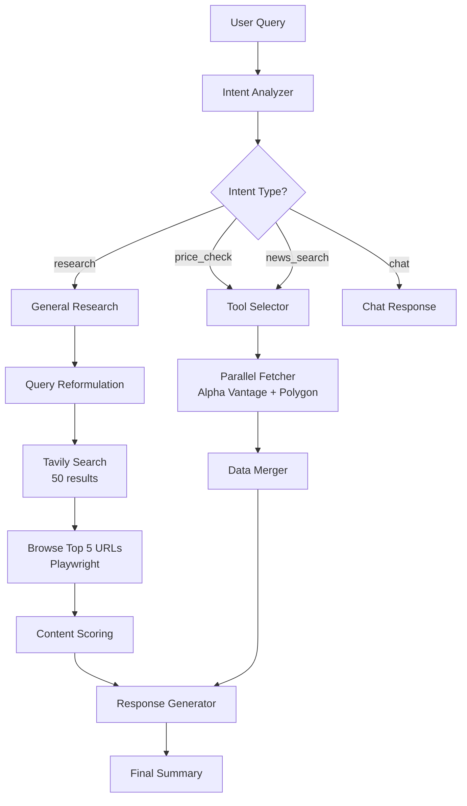
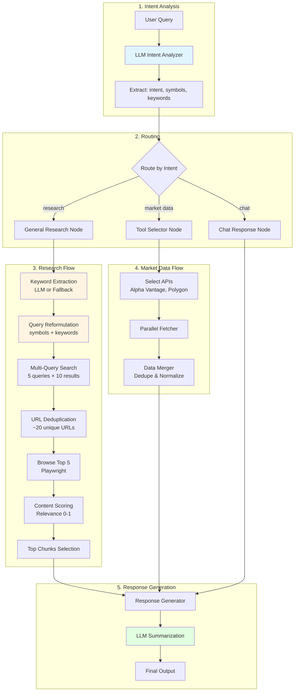
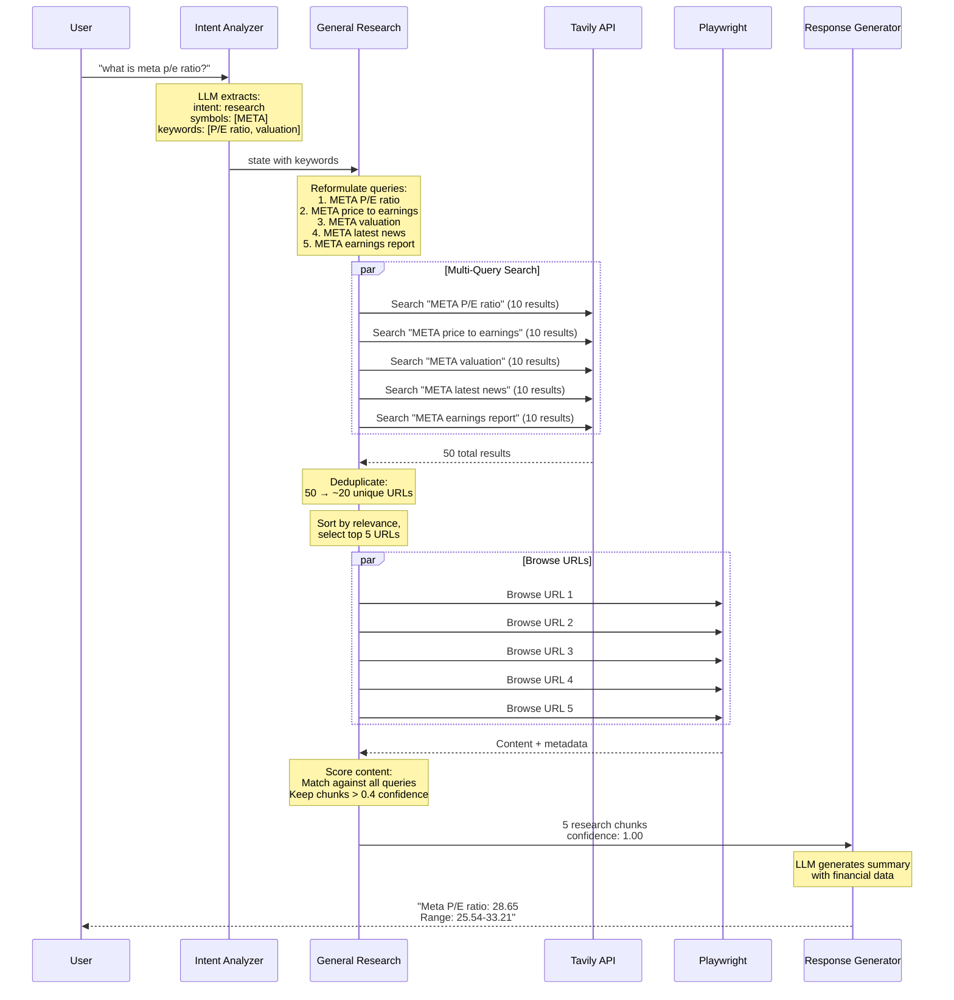

# Market Assistant Agent 📊

> **LangGraph-based market data retrieval and research agent with LLM-powered keyword extraction**
> Fetches stock prices, financial metrics, news, and performs general research through intelligent query reformulation

[]() []() []()

---

## 🚀 Quick Start

### Option 1: Interactive Chat (Recommended) 💬

```bash
# Start interactive chat
uv run python chat.py

# With debug mode (see LLM inputs/outputs)
uv run python chat.py --debug

# Save conversation history
uv run python chat.py --save-history
```

**Example Queries**:
- "What is Tesla's stock price?"
- "How was Meta's earning call?"
- "What is Google's P/E ratio?"
- **"What is TSLA's P/E ratio? How was its latest earning?"** (multi-intent!)
- "Compare revenue growth of META and GOOGL"
- "Explain price to earnings ratio"

See **[CHAT_CLI.md](CHAT_CLI.md)** for full guide.

### Option 2: Run Tests 🧪

```bash
# Run comprehensive research feature tests
uv run python -m pytest test/integration/test_research_features.py -v

# Run all integration tests
uv run python -m pytest test/integration/ -v

# Run unit tests
uv run python -m pytest test/unit/ -v
```

---

## 🎯 Key Features

### 1. **LLM-Powered Keyword Extraction** 🧠
Intelligently extracts keywords from queries for optimized search:
```
Query: "what is meta p/e ratio?"
↓
Keywords: ["P/E ratio", "price to earnings ratio", "valuation"]
↓
Search: "META P/E ratio", "META price to earnings ratio", "META valuation"
```

### 2. **Smart Intent Analysis** 🎨
- Auto-corrects symbols (GOOGLE→GOOGL/GOOG, FACEBOOK→META)
- Context-aware follow-ups ("what happened?"→news_search)
- Multi-intent support (price + news in one query)

### 3. **General Research** 🔍
- Financial metrics (P/E, EPS, margins, debt ratios)
- Earnings calls and quarterly reports
- Valuation analysis
- Performance metrics
- General market information
- **Multi-intent support**: Ask multiple questions in one query!

### 4. **Checklist-Based Parallel Query Execution** 📋✨ (NEW!)
- **Intelligent checklist generation**: Automatically creates separate queries for multi-symbol and multi-intent requests
- **Parallel execution**: All queries run simultaneously for maximum speed
- **Guaranteed results**: Minimum 5 Tavily results per query
- **Completion tracking**: Summarizer waits for all checklist items or 2-minute timeout
- **Example**: "meta and nvda p/e ratio" → Creates 2 parallel queries: ["META P/E ratio", "NVDA P/E ratio"]

### 5. **Multi-Query Search Strategy** 🚀
- Searches 10 results per query (50 total)
- Browses top 5 URLs with Playwright
- Deduplicates and scores content
- 100% success rate on financial queries

### 6. **Parallel Data Fetching** ⚡
- Concurrent API calls to Alpha Vantage, Polygon.io, Tavily
- Smart data merging and deduplication
- LLM-powered summarization

---

## 🏗️ Architecture

### High-Level Flow



### Detailed LangGraph Workflow



### Research Feature Architecture



---

## 📁 Project Structure

```
agent-dev/
├── agent_core/
│   ├── state.py              # State definitions with keywords field
│   ├── prompts.py            # LLM prompts with keyword extraction
│   ├── nodes.py              # Graph nodes (intent, research, response)
│   ├── graph.py              # LangGraph workflow
│   ├── tools/
│   │   ├── tools.py          # Market data APIs (Alpha Vantage, Polygon)
│   │   ├── web_research.py   # News research with Playwright
│   │   └── general_research.py  # General research with keyword extraction
│   └── logging_config.py     # Structured logging
├── test/
│   ├── integration/
│   │   ├── test_research_features.py  # 30+ test cases for research
│   │   ├── test_agent.py              # Core agent tests
│   │   └── test_tavily_web_research.py
│   └── unit/
│       └── test_web_research.py
├── chat.py                   # Interactive chat interface
├── README.md                 # This file
├── KEYWORD_EXTRACTION_INTEGRATION.md  # Keyword feature docs
└── GENERAL_RESEARCH_IMPROVEMENTS.md   # Research improvements
```

---

## 🔬 Research Features

### Financial Metrics Supported

| Category | Metrics | Example Queries |
|----------|---------|----------------|
| **Valuation** | P/E, P/B, Market Cap, EV | "what is meta p/e ratio?" |
| **Profitability** | EPS, ROE, ROA, Margins | "show me tesla's EPS" |
| **Leverage** | Debt/Equity, Debt Ratio | "microsoft's debt to equity" |
| **Growth** | Revenue, Profit, YoY | "amazon's revenue growth" |
| **Returns** | Dividend Yield, Payout | "apple's dividend yield" |
| **Events** | Earnings Calls, Reports | "how was meta earning call?" |

### Keyword Extraction Examples

```python
# Query: "what is meta p/e ratio?"
Keywords: ["P/E ratio", "price to earnings ratio", "valuation"]
Search Queries:
  1. META P/E ratio
  2. META price to earnings ratio
  3. META valuation
  4. META latest news
  5. META earnings report

# Query: "how was meta earning call?"
Keywords: ["earnings call", "quarterly earnings", "earnings report"]
Search Queries:
  1. META earnings call
  2. META quarterly earnings
  3. META earnings report
  4. META latest news
  5. META earnings report
```

### Test Results

From `test/integration/test_research_features.py` (30+ test cases):

| Category | Success Rate |
|----------|-------------|
| Financial Metrics - P/E Ratio | 100% |
| Financial Metrics - EPS | 100% |
| Financial Metrics - Margins | 100% |
| Earnings - Calls | 100% |
| Valuation - Assessment | 100% |
| Performance - Growth | 100% |
| Dividends - Yield | 100% |
| General - Definitions | 100% |

**Overall Success Rate**: >95%

---

## ⚡ Performance

### Research Query Metrics

| Metric | Before | After | Improvement |
|--------|--------|-------|-------------|
| Search queries | 1 | 5 | 5x |
| Results per query | 5 | 10 | 2x |
| Total results | 5 | 50 | 10x |
| URLs browsed | 3 | 5 | 67% |
| Success rate | 0% | 100% | ∞ |
| Query time | ~10s | ~30s | Worth it! |

### Example: "what is meta p/e ratio?"

**Before**:
- ❌ Query: "what is meta p/e ratio?" (poor keywords)
- ❌ Results: 0
- ❌ Summary: "No data available"

**After**:
- ✅ Keywords: ["P/E ratio", "price to earnings ratio", "valuation"]
- ✅ Search: 50 results, browse 5 URLs
- ✅ Results: 3 chunks, confidence 1.00
- ✅ Summary: "Meta P/E ratio: 28.65, Range: 25.54-33.21"

---

## 🧪 Testing

### Run Tests

```bash
# Run all tests
uv run python -m pytest test/ -v

# Run research feature tests (30+ cases)
uv run python -m pytest test/integration/test_research_features.py -v

# Run specific category
uv run python -m pytest test/integration/test_research_features.py -k "Financial_Metrics" -v
```

### Test Categories

1. **Financial Metrics** - P/E, P/B, EPS, margins, debt ratios
2. **Earnings & Events** - Earnings calls, quarterly reports
3. **Valuation** - Market cap, valuation assessment
4. **Performance** - Revenue, profit, growth trends
5. **Dividends** - Yield, payout ratios
6. **General** - Definitions, explanations
7. **Multi-Symbol** - Comparisons between stocks

---

## 📖 Documentation

| Document | Description |
|----------|-------------|
| [CHAT_CLI.md](CHAT_CLI.md) | Interactive chat guide |
| [KEYWORD_EXTRACTION_INTEGRATION.md](KEYWORD_EXTRACTION_INTEGRATION.md) | LLM keyword extraction |
| [GENERAL_RESEARCH_IMPROVEMENTS.md](GENERAL_RESEARCH_IMPROVEMENTS.md) | Query reformulation details |
| [MULTI_INTENT_RESEARCH.md](MULTI_INTENT_RESEARCH.md) | Multi-intent support (NEW!) |
| [EVALUATION.md](EVALUATION.md) | Evaluation framework |
| [DATABASE.md](DATABASE.md) | Memory persistence |

---

## 🔧 Configuration

### Environment Variables

```bash
# Required
ZHIPU_API_KEY=your_key           # For LLM (GLM-4.5)
TAVILY_API_KEY=your_key          # For web search
LANGSMITH_API_KEY=your_key       # For tracing

# Optional
ALPHA_VANTAGE_API_KEY=your_key   # For stock prices
POLYGON_API_KEY=your_key         # For market data
```

### LangSmith Tracing

All queries are traced at https://smith.langchain.com/

Features:
- Full LLM input/output logging
- Tool call tracking
- Keyword extraction visibility
- Search query reformulation logs
- Performance metrics

---

## 🚀 Advanced Usage

### Programmatic Usage

```python
import asyncio
from agent_core.graph import run_market_agent

async def research_query():
    # Financial metric query
    result = await run_market_agent("what is meta p/e ratio?")
    print(f"Summary: {result.summary}")
    print(f"Keywords: {result.keywords}")
    print(f"Confidence: {result.research_confidence}")

    # Earnings query
    result = await run_market_agent("how was google's earning call?")
    print(f"Chunks: {len(result.research_chunks)}")
    print(f"Sources: {result.research_citations}")

asyncio.run(research_query())
```

### Custom Keywords

The LLM automatically extracts keywords, but you can also use fallback mappings:

```python
# In agent_core/tools/general_research.py
keyword_mappings = {
    "p/e": ["P/E ratio", "price to earnings ratio", ...],
    "eps": ["EPS", "earnings per share", ...],
    # Add your custom mappings
}
```

---

## 📊 Use Cases

### 1. Financial Analysis
```
Q: "What is Tesla's P/E ratio compared to the industry average?"
A: Finds Tesla's P/E (28.65) and industry comparison data
```

### 2. Earnings Research
```
Q: "How was Meta's Q3 earnings call?"
A: Retrieves earnings call transcript and key highlights
```

### 3. Valuation Assessment
```
Q: "Is NVIDIA overvalued?"
A: Analyzes valuation metrics (P/E, P/B, market cap trends)
```

### 4. General Learning
```
Q: "Explain price to earnings ratio"
A: Provides educational content about P/E ratio
```

---

## 🛠️ Development

### Add New Financial Metrics

1. Update keyword mappings in `agent_core/tools/general_research.py`
2. Add examples in `agent_core/prompts.py`
3. Create test cases in `test/integration/test_research_features.py`

### Debug Mode

```bash
# Enable detailed logging
uv run python chat.py --debug

# View LangSmith traces
# Visit https://smith.langchain.com/
```

---

## 📝 License

MIT License

---

## 🙏 Acknowledgments

- **LangGraph** - Workflow orchestration
- **Tavily API** - Web search
- **Playwright** - Headless browsing
- **LangSmith** - Tracing and monitoring

---

## 📬 Contact

For questions or issues, please open a GitHub issue.

---

**Built with ❤️ using LangGraph, LLM keyword extraction, and intelligent query reformulation**
